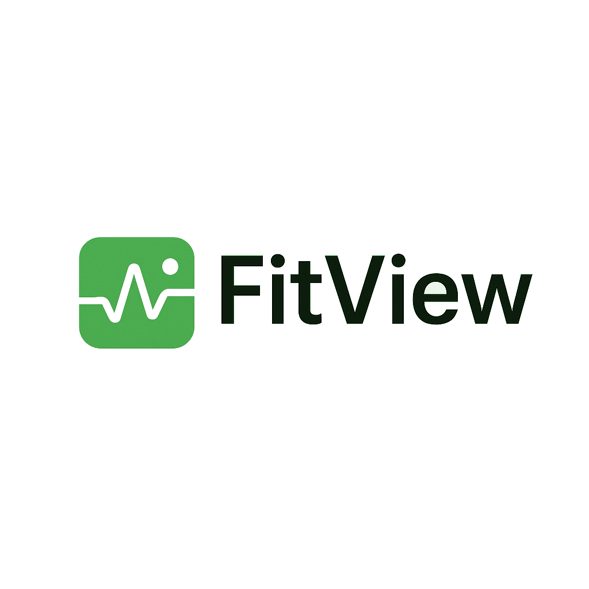

# FitView - Your Personal Fitbit Nutrition Dashboard



[FitView](https://fitview.mehmetseckin.com) is a web application designed to provide a clear and insightful view of your daily nutrition intake logged via Fitbit.

## Motivation

With the discontinuation of the Fitbit web dashboard, there was a gap for users who preferred managing and viewing their nutrition data on a desktop browser rather than solely through the mobile app. FitView aims to fill that gap by offering a web-based interface to connect with your Fitbit account, log food entries, and visualize your nutritional progress.

## Features

*   **Connect to Fitbit:** Securely link your Fitbit account to fetch your nutrition data.
*   **Daily Nutrition Summary:** Visualize your consumed calories, protein, carbohydrates, and fat against your daily goals.
*   **Macronutrient Breakdown:** See your macronutrient distribution in an easy-to-understand pie chart and progress bars.
*   **Food Logging:** Search for foods using the Fitbit database and log them to your daily intake for specific meals.
*   **Food Log Viewing:** See a detailed list of foods logged for the current day, filterable by meal type.
*   **Goal Setting:** View and potentially edit your daily calorie and macronutrient goals (based on component structure).

## Tech Stack

*   **Frontend:** React, TypeScript
*   **Build Tool:** Vite
*   **Styling:** Tailwind CSS
*   **UI Components:** shadcn-ui
*   **Charts:** Recharts
*   **Backend (Functions):** Deno (for Supabase Edge Functions acting as a Fitbit proxy/auth handler)
*   **Authentication/Database:** Supabase (for user management and Fitbit token storage)

## Getting Started

To run FitView locally, follow these steps:

1.  **Clone the repository:**
    ```sh
    git clone <YOUR_GIT_URL>
    cd fitview
    ```

2.  **Install dependencies:**
    ```sh
    npm install
    # or
    yarn install
    ```

3.  **Set up Environment Variables:**
    *   This project requires Supabase and Fitbit API credentials. You'll need to set up a Supabase project and a Fitbit application.
    *   Create a `.env` file in the root directory and potentially within the `supabase/functions` directories.
    *   Populate the `.env` files with necessary variables like:
        *   `VITE_SUPABASE_URL`
        *   `VITE_SUPABASE_ANON_KEY`
        *   `SUPABASE_URL` (for Edge Functions)
        *   `SUPABASE_SERVICE_ROLE_KEY` (for Edge Functions)
        *   `FITBIT_CLIENT_ID`
        *   `FITBIT_CLIENT_SECRET`
        *   `APP_URL` (Your local development URL, e.g., `http://localhost:8080`)

4.  **Set up Supabase:**
    *   Ensure you have the [Supabase CLI](https://supabase.com/docs/guides/cli) installed and you are logged in (`supabase login`).
    *   Link your local project to your Supabase project: `supabase link --project-ref <YOUR_PROJECT_ID>` (Replace `<YOUR_PROJECT_ID>` with your actual Supabase project ID).
    *   Push the database schema: `supabase db push`. This will apply the migrations located in the `supabase/migrations` directory.
    *   Deploy the Edge Functions: `supabase functions deploy fitbit-auth --no-verify-jwt` and `supabase functions deploy fitbit-proxy --no-verify-jwt`.

5.  **Run the development server:**
    ```sh
    npm run dev
    # or
    yarn dev
    ```
    This will start the Vite development server, typically available at `http://localhost:8080` (or the port configured in `vite.config.ts`).

## Contributing

Contributions are welcome! If you'd like to improve FitView, please feel free to fork the repository, make your changes, and submit a pull request. You can also open an issue to report bugs or suggest features.

## License

This project is licensed under the MIT License. See the [LICENSE.md](LICENSE.md) file for details.
